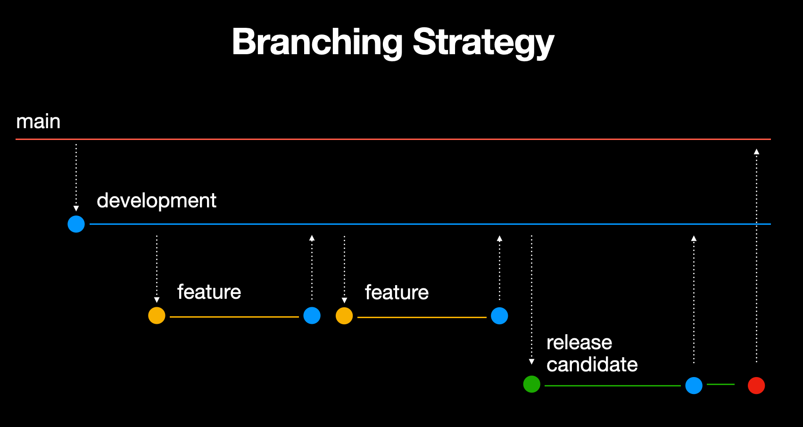

# GitHubRepository
 
## Description
Build a simple iOS application that fetches and displays a list of repositories for a specific GitHub user

## MVVM Architecture
This iOS project implements the MVVM (Model-View-ViewModel) architecture. MVVM separates the app's data (Model), UI (View), and the logic that ties the data to the UI (ViewModel). This approach promotes a clean code structure, making it easier to manage and test. The ViewModel handles data fetching and business logic, ensuring the View remains simple and focused on displaying the UI. This setup enhances code maintainability and scalability.

## Project Structure

A description of the project folder structure:

### GitHubRepository

- **App**
  - `AppDelegate`: Manages app-level events.
  - `SceneDelegate`: Manages scene-level events for multi-window support.

- **API**
  - **Service**: Contains all the service classes responsible for network calls and data fetching.

- **Screens**
  - **Repositories**: Represents a screen in the app.
    - `ViewController`: Contains the view controller logic and manages the UI lifecycle.
    - `ViewModel`: Handles data fetching and business logic, acting as an intermediary between the View and the Model.
    - `Model`: Defines the data structures used in this feature.
    - `View`: Contains UI components and layout definitions for this screen.

- **Shared**
  - Contains all shared code and resources that can be used across different features of the app.

This structure ensures a modular approach, where each screen has its own set of Model, View, and ViewModel files, making the codebase easier to navigate and maintain. Shared resources are centralized, promoting code reuse and reducing redundancy.

## Branching Strategy

Here is the branching strategy for this project:


## Features

### 1. Repositories

#### Network Layer

- `GitHubService`: A network service layer has been implemented to handle the fetching of repository data from GitHub using Combine.

- `GitHubServiceProtocol`: A protocol that outlines the interface for GitHubService.
```swift
protocol GitHubServiceProtocol: AnyObject {
  var repositoriesPublisher: AnyPublisher<[Repository], NetworkError> { get }

  func fetchRepositories(for user: String)
}
```

- `NetworkError`: An enum that defines various error types that can occur during network requests.
```swift
enum NetworkError: Error {
  case invalidURL
  case emptyUser
  case decodingFailed
  case unknown(String)
}
```

- `GitHubServiceTest`: A unit test class that verifies the functionality of GitHubService.
```swift
func testFetchRepositoriesSuccess()
func testFetchRepositoriesInvalidURL()
func testFetchRepositoriesEmptyUser()
func testFetchRepositoriesDecodingError()
```

#### Model
- **Repository Model**

A `Repository` model represent the data received from the GitHub API. This model includes properties that map to the JSON structure of the API response.
```swift
struct Repository: Codable {

  let id: Int
  let name: String
  let description: String?
}
```
