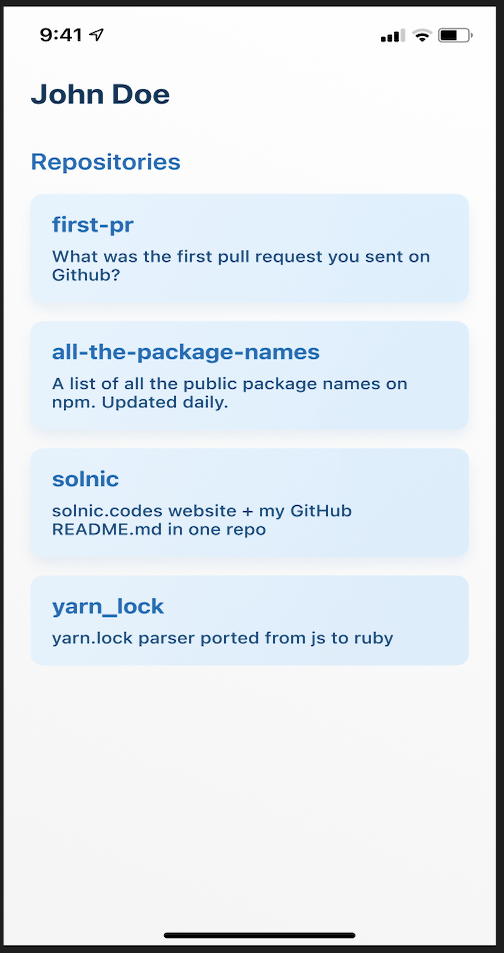
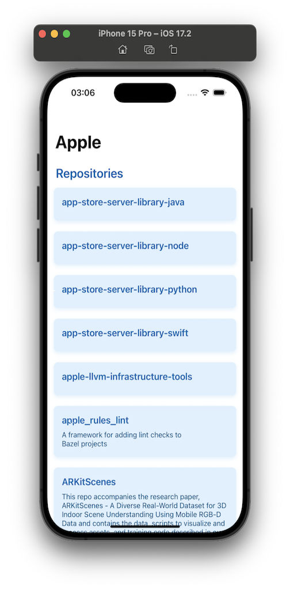
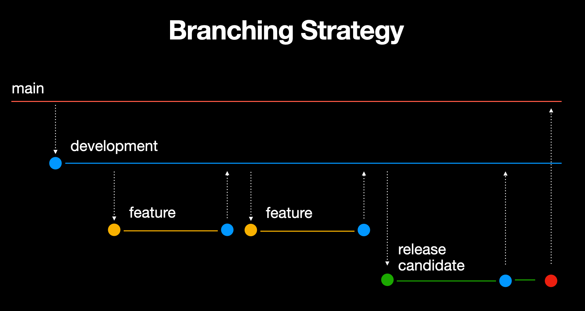

# GitHubRepository
 
## Description
Build a simple iOS application that fetches and displays a list of repositories for a specific GitHub user

## App Design


|  Sample | Final  |
|---|---|
|  | |
## MVVM Architecture
This iOS project implements the MVVM (Model-View-ViewModel) architecture. MVVM separates the app's data (Model), UI (View), and the logic that ties the data to the UI (ViewModel). This approach promotes a clean code structure, making it easier to manage and test. The ViewModel handles data fetching and business logic, ensuring the View remains simple and focused on displaying the UI. This setup enhances code maintainability and scalability.

## Project Structure

A description of the project folder structure:

### GitHubRepository

- **App**
  - `AppDelegate`: Manages app-level events.
  - `SceneDelegate`: Manages scene-level events for multi-window support.

- **API**
  - **Service**: Contains all the service classes responsible for network calls and data fetching.

- **Screens**
  - **Repositories**: Represents a screen in the app.
    - `ViewController`: Contains the view controller logic and manages the UI lifecycle.
    - `ViewModel`: Handles data fetching and business logic, acting as an intermediary between the View and the Model.
    - `Model`: Defines the data structures used in this feature.
    - `View`: Contains UI components and layout definitions for this screen.

- **Shared**
  - Contains all shared code and resources that can be used across different features of the app.

This structure ensures a modular approach, where each screen has its own set of Model, View, and ViewModel files, making the codebase easier to navigate and maintain. Shared resources are centralized, promoting code reuse and reducing redundancy.

## Branching Strategy

Here is the branching strategy for this project:


> The final version for this project's requirements is in `release-candidate-1` and has been merged to `main`.
> Every new version will be added in a new `release-candidate-x` branch, which will then be merged to `main`.

> [!IMPORTANT]  
> Checkout `main` branch to see `Senior iOS Developer Test Task`.

> [!NOTE]  
> Extra features added (like `Search Repositories by Username`, `Repository Detail screen `, `Favourite Repository`) can be found on `development` branch.

## Features

### 1. Repositories

#### Network Layer

- `GitHubService`: A network service layer has been implemented to handle the fetching of repository data from GitHub using Combine.

- `GitHubServiceProtocol`: A protocol that outlines the interface for GitHubService.
```swift
protocol GitHubServiceProtocol: AnyObject {
  var repositoriesPublisher: AnyPublisher<[Repository], NetworkError> { get }

  func fetchRepositories(for user: String)
}
```

- `NetworkError`: An enum that defines various error types that can occur during network requests.
```swift
enum NetworkError: Error {
  case invalidURL
  case emptyUser
  case decodingFailed
  case unknown(String)
}
```

- `GitHubServiceTest`: A unit test class that verifies the functionality of GitHubService.
```swift
func testFetchRepositoriesSuccess()
func testFetchRepositoriesInvalidURL()
func testFetchRepositoriesEmptyUser()
func testFetchRepositoriesDecodingError()
```
---
#### Model
- **Repository Model**

A `Repository` model represent the data received from the GitHub API. This model includes properties that map to the JSON structure of the API response.
```swift
struct Repository: Codable {

  let id: Int
  let name: String
  let description: String?
}
```
---
#### ViewModel
- **Repository ViewModel**

`ReposViewModel` to fetch repository data and manage state using Combine. Containing three `@Publishers` for updating and managing the state of the UI. 
```swift
@MainActor
final class ReposViewModel: ObservableObject {

  .. 

  @Published private(set) var repositories: [Repository] = []
  @Published private(set) var state: ReposViewModelState = .loading
  @Published private(set) var userName: String = "Apple"

  init(reposService: GitHubServiceProtocol) { .. }

  func fetchRepositories(for user: String) { .. }

  ..
}
```

 The `ReposViewModelState` enum represents the different states of the repository fetching process, including loading, finished loading, and error states. 

 ```swift 
enum ReposViewModelState: Equatable {
  case loading
  case finishedLoading
  case error(ReposViewModelError)
}
 ```

The `Section` enum defines a single `case repositories` used to categorize the repository items within the collection view.
```swift
enum Section { case repositories }
```

- `ReposViewModelTests`: A unit test class that verifies the functionality of ReposViewModel.
```swift
func testFetchRepositoriesSuccess()
func testFetchRepositoriesFailure()
func testUserNameUpdates()
```

---

#### ViewController
- **Repository ViewController**

The `ReposViewController` class is a view controller that manages the display of a collection view, binds to the `ReposViewModel`, and updates the UI based on the state of the repository fetching process.

```swift
final class ReposViewController: UIViewController {
  
  private typealias DataSource ..
  private typealias Snapshot .. 

  init(viewModel: ReposViewModel) { .. }

  override func viewDidLoad() {
    ..
    setupViews()
    configureDataSource()
    bindViewModel()
  }

  ..
}
```
---
#### View

- **ListView**

The `ListView` class is a custom `UIView` subclass that sets up and manages a `UICollectionView` and a `UIActivityIndicatorView`, providing the layout and handling the loading states for displaying a list of items.

```swift
final class ListView: UIView {

  lazy var collectionView = UICollectionView( .. )
  lazy var activityIndicationView = UIActivityIndicatorView( .. )
  
  ..
```
- **RepositoryCollectionViewCell**

The `RepositoryCollectionViewCell` class is a custom `UICollectionViewCell` subclass designed to display the details of a repository, including its name and description, within a collection view.

```swift
final class RepositoryCollectionViewCell: UICollectionViewCell {
  
  static let identifier = "RepositoryCollectionViewCell"
  private lazy var nameLabel: UILabel = { .. }()
  private lazy var descriptionLabel: UILabel = { .. }()

  ..
}
```
---
